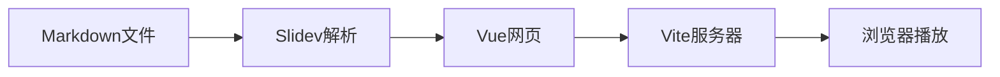
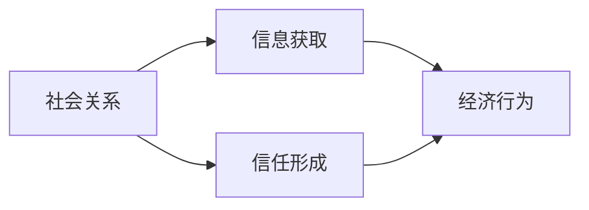

# Slidev 使用与网页发布指南

从本地安装、Markdown 写作到网页链接发布

<div class="pt-8 text-gray-500">
Node.js · Yarn · Obsidian · GitHub Pages
</div>

<!--
本教程以 Windows、Yarn 和 Obsidian 为例。
-->

---
layout: default
---

# 本教程包括什么

<div class="grid grid-cols-2 gap-8 mt-10">

<div>

## 基础使用

- Slidev 的运行原理
- 项目安装与启动
- 页面、标题和正文语法
- 主题、布局和基础美化

</div>

<div>

## 分享发布

- 导出 PDF、PPTX 和图片
- 构建静态网页
- 使用 GitHub Pages 生成链接
- 修改后自动更新网页

</div>

</div>

---

# 1. Slidev 是什么

Slidev 是一个使用 **Markdown 编写幻灯片**的开源工具。

它可以把 `.md` 文件转换成浏览器中的演示文稿，并支持：

- LaTeX 数学公式
- 代码高亮
- Mermaid 流程图
- Vue 网页组件
- 点击动画和演讲者备注
- PDF、PPTX、PNG 和网页发布

<div class="mt-8 p-5 bg-blue-50 border-l-4 border-blue-500 rounded">

**适用场景：** 将 Obsidian 笔记整理成组会、课程、答辩或技术汇报。

</div>

---

# 2. Slidev 的运行原理



运行 Slidev 后，电脑会临时启动一个本地网页服务器：

```text
http://localhost:3030
```

- 修改并保存 Markdown 后，浏览器自动更新；
- 在 PowerShell 中按 `Ctrl + C`，服务器停止；
- `localhost` 只能代表当前电脑，不能直接作为公网链接分享。

---

# 3. Node.js、Yarn 和 Slidev

| 工具 | 作用 | 类比 Python 生态 |
|---|---|---|
| Node.js | 运行 JavaScript 程序 | Python 解释器 |
| npm | Node.js 自带的包管理器 | pip |
| Yarn | 安装依赖、执行项目命令 | pip 或 conda |
| Slidev | Markdown 幻灯片工具 | 一个第三方应用 |

<div class="mt-8 text-2xl text-center font-bold text-blue-700">
Node.js 提供运行环境，Yarn 负责安装和管理 Slidev。
</div>

---

# 4. 安装 Node.js 和 Yarn

从 [Node.js 官网](https://nodejs.org/zh-cn)安装 LTS 版本，然后重新打开 PowerShell。

```powershell
# 检查 Node.js
node -v

# 检查 npm
npm -v

# 安装 Yarn
npm install -g yarn

# 检查 Yarn
yarn --version
```

只要相应命令能够显示版本号，就说明安装成功。

---

# 5. 创建本地 Slidev 项目

先进入准备保存项目的位置：

```powershell
cd "D:\Obsidian"
```

创建项目：

```powershell
yarn create slidev
```

根据提示输入项目名称，例如：

```text
社会经济学汇报
```

然后进入项目并安装依赖：

```powershell
cd "D:\Obsidian\社会经济学汇报"
yarn install
```

---

# 6. 项目文件放在哪里

```text
社会经济学汇报
├─ slides.md
├─ package.json
├─ yarn.lock
├─ node_modules
├─ public
└─ components
```

| 文件或文件夹 | 作用 |
|---|---|
| `slides.md` | 默认的幻灯片正文 |
| `package.json` | 项目配置、脚本和依赖 |
| `yarn.lock` | 锁定依赖版本 |
| `node_modules` | 当前项目安装的软件包 |
| `public` | 图片和视频等静态资源 |
| `components` | 自定义 Vue 组件 |

---

# 7. 启动和退出

进入项目并启动：

```powershell
cd "D:\Obsidian\社会经济学汇报"
yarn dev
```

浏览器地址通常是：

```text
http://localhost:3030
```

其他常用操作：

```powershell
# 指定其他 Markdown 文件
yarn slidev "社会经济学.md"

# 更换端口
yarn slidev --port 3031
```

退出时在 PowerShell 中按 `Ctrl + C`。

---

# 8. Slidev 如何识别页面

Slidev 使用单独一行的 `---` 分隔幻灯片：

````markdown
# 第一页

第一页的内容

---

# 第二页

第二页的内容
````

<div class="mt-8 p-5 bg-orange-50 border-l-4 border-orange-500 rounded">

文件最开头由一对 `---` 包围的是全局配置；后续的 `---` 才是分页符。

</div>

---

# 9. 标题和正文怎么识别

```markdown
# 页面主标题

## 页面内的小标题

这是普通正文。

- 第一项内容
- 第二项内容
```

| 写法 | 用途 |
|---|---|
| `# 标题` | 当前页面的大标题 |
| `## 标题` | 页面内的小标题 |
| 普通文字 | 正文 |
| `- 文字` | 无序列表 |
| `1. 文字` | 有序列表 |
| `**文字**` | 加粗强调 |

---

# 10. 整份演示文稿的配置

全局配置必须放在 `slides.md` 的最开头：

```yaml
---
theme: seriph
title: 社会经济学
author: 张三
colorSchema: light
aspectRatio: 16/9
canvasWidth: 980
transition: fade
lineNumbers: false
layout: cover
class: text-center
---
```

这部分称为 **Headmatter**，影响整套演示文稿。

---

# 11. 常用全局配置

| 配置 | 作用 | 常用值 |
|---|---|---|
| `theme` | 整套视觉主题 | `default`、`seriph` |
| `title` | 演示文稿标题元数据 | 自定义文字 |
| `author` | 作者元数据 | 姓名 |
| `colorSchema` | 明暗模式 | `light`、`dark` |
| `aspectRatio` | 页面比例 | `16/9`、`4/3` |
| `canvasWidth` | 逻辑画布宽度 | `980` |
| `transition` | 页面切换效果 | `fade`、`slide-left` |
| `lineNumbers` | 是否显示代码行号 | `true`、`false` |

标题和作者属于元数据，不一定自动显示在封面；封面正文中仍要写出来。

---

# 12. 使用主题

在文件开头设置：

```yaml
theme: seriph
```

常见主题：

- `default`：简洁，适合技术报告；
- `seriph`：具有设计感，适合学术和课程报告。

第一次使用主题时，Slidev 可能询问是否安装，输入 `y` 即可。

也可以手动安装：

```powershell
yarn add -D @slidev/theme-seriph
```

主题库：[Slidev Theme Gallery](https://sli.dev/resources/theme-gallery)

---

# 13. 单页布局：封面和居中

<div class="grid grid-cols-2 gap-8">

<div>

## 封面

```markdown
---
layout: cover
---

# 社会经济学

张三｜2026年8月
```

</div>

<div>

## 居中强调

```markdown
---
layout: center
class: text-center
---

# 核心研究问题

社会关系如何影响经济行为？
```

</div>

</div>

单页配置中的 `---`、配置项和结束的 `---` 必须紧邻书写。

---

# 14. 单页布局：两栏

````markdown
---
layout: two-cols
---

# 理论机制

## 信息机制

- 扩大信息来源
- 减少信息不对称

::right::

## 信任机制

- 降低监督成本
- 减少违约风险
````

`::right::` 之前进入左栏，之后进入右栏。

---

# 15. 数学公式

在 Markdown 中直接使用 LaTeX：

```markdown
$$
Y_{it}=\beta Social_{it}+\gamma X_{it}
+\mu_i+\lambda_t+\varepsilon_{it}
$$
```

显示效果：

$$
Y_{it}=\beta Social_{it}+\gamma X_{it}
+\mu_i+\lambda_t+\varepsilon_{it}
$$

适合展示回归模型、定义公式和理论推导。

---

# 16. 代码高亮

代码块开头标注语言：

````markdown
```python
def calculate_growth(current, previous):
    return (current - previous) / previous
```
````

显示效果：

```python
def calculate_growth(current, previous):
    return (current - previous) / previous
```

如果 Shiki 不认识某个语言名称，可以把代码块语言改成 `text`。

---

# 17. Mermaid 流程图

````markdown

````

适合绘制：

- 研究框架
- 理论机制
- 工作流程
- 简单的因果路径

---

# 18. 添加图片

把图片放入：

```text
public/images/network.png
```

Markdown 写法：

```markdown

```

控制大小并居中：

```html

```

网页发布时，优先把图片放在 `public` 中，路径更容易管理。

---

# 19. 使用 UnoCSS 美化

强调一句结论：

```html
<div class="text-3xl font-bold text-blue-700">
社会关系能够降低交易成本
</div>
```

常用样式：

| 样式 | 作用 |
|---|---|
| `text-center` | 居中 |
| `text-3xl` | 增大字号 |
| `font-bold` | 加粗 |
| `text-blue-700` | 深蓝色文字 |
| `text-gray-500` | 灰色辅助文字 |
| `mt-8` | 增加上边距 |
| `p-5` | 增加内部留白 |
| `rounded` | 圆角 |

---

# 20. 设置全局 CSS

在 `slides.md` 最后添加：

```html
<style>
:root {
  --slidev-theme-primary: #1e4f8a;
}

.slidev-layout {
  font-family: "Microsoft YaHei", sans-serif;
  color: #263238;
}

.slidev-layout h1 {
  color: #1e4f8a;
  font-weight: 700;
}

.slidev-layout p,
.slidev-layout li {
  line-height: 1.7;
}
</style>
```

CSS 能统一整套幻灯片的字体、标题颜色和正文行距。

---

# 21. 点击动画

使用 `<v-clicks>` 让项目逐项出现：

````markdown
# 理论机制

<v-clicks>

- 社会关系扩大信息来源
- 信任降低交易成本
- 网络位置影响资源获得

</v-clicks>
````

播放时，每按一次空格键或方向键，就会显示下一项。

---

# 22. 演讲者备注

在页面末尾使用 HTML 注释：

```markdown
# 研究背景

- 信息不对称
- 交易成本

<!--
这一页先解释传统分析的不足，
再引出社会关系的影响。
-->
```

演讲者模式：

```text
http://localhost:3030/presenter/
```

公开构建时，可以删除备注，避免备注被访问。

---

# 23. 一份报告怎么组织

推荐顺序：

1. 封面
2. 研究背景
3. 研究问题
4. 理论机制或研究框架
5. 数据和方法
6. 实证结果
7. 研究结论
8. 政策建议或讨论
9. 致谢

<div class="mt-8 p-5 bg-blue-50 border-l-4 border-blue-500 rounded">

**排版原则：** 每页只讲一个核心观点，正文尽量控制在 3～5 个要点。

</div>

---

# 24. 导出 PDF、PPTX 和 PNG

第一次使用命令行导出，安装浏览器渲染组件：

```powershell
yarn add -D playwright-chromium
```

然后运行：

```powershell
# PDF
yarn slidev export

# PPTX
yarn slidev export --format pptx

# PNG
yarn slidev export --format png
```

也可以打开 `http://localhost:3030/export/` 使用浏览器导出界面。

---

# 25. 构建静态网页

在项目目录运行：

```powershell
yarn slidev build --without-notes
```

项目中会生成：

```text
dist
├─ index.html
└─ assets
```

`dist` 是网站成品，但仅生成它并不会自动获得公网链接。

本地检查构建结果：

```powershell
yarn vite preview
```

---

# 26. GitHub Pages 发布逻辑


最终链接通常是：

```text
https://你的用户名.github.io/仓库名称/
```

GitHub Pages 适合免费、长期公开展示 Slidev 演示文稿。

---

# 27. 创建 GitHub 仓库

1. 登录 [GitHub](https://github.com/)；
2. 点击右上角 `+`；
3. 选择 `New repository`；
4. 仓库名使用英文，例如 `slidev-guide`；
5. 选择 `Public`；
6. 点击 `Create repository`。

如果 Windows 尚未安装 Git，可以从 [Git 官网](https://git-scm.com/download/win)下载安装。

---

# 28. 上传本地项目

在项目目录运行：

```powershell
git init
git add .
git commit -m "Initial Slidev presentation"
git branch -M main
git remote add origin https://github.com/你的用户名/slidev-guide.git
git push -u origin main
```

确认 `.gitignore` 包含：

```text
node_modules
dist
```

不需要上传这两个文件夹，GitHub 会自动安装和构建。

---

# 29. 创建自动部署文件

在项目根目录创建：

```text
.github/workflows/deploy.yml
```

文件开头写入：

```yaml
name: Deploy Slidev to GitHub Pages

on:
  workflow_dispatch:
  push:
    branches: [main]

permissions:
  contents: read
  pages: write
  id-token: write

concurrency:
  group: pages
  cancel-in-progress: false
```

---

# 30. 配置构建任务

继续在 `deploy.yml` 中写入：

```yaml
jobs:
  build:
    runs-on: ubuntu-latest
    steps:
      - uses: actions/checkout@v7
      - uses: actions/setup-node@v6
        with:
          node-version: "lts/*"
      - run: corepack enable
      - run: yarn install --immutable
      - run: yarn slidev build --base /${{ github.event.repository.name }}/ --without-notes
      - uses: actions/configure-pages@v6
      - uses: actions/upload-pages-artifact@v5
        with:
          path: dist
```

如果使用 Yarn 1，把 `yarn install --immutable` 改为 `yarn install --frozen-lockfile`。

---

# 31. 配置发布任务

继续在 `deploy.yml` 最后写入：

```yaml
  deploy:
    environment:
      name: github-pages
      url: ${{ steps.deployment.outputs.page_url }}
    needs: build
    runs-on: ubuntu-latest
    steps:
      - name: Deploy
        id: deployment
        uses: actions/deploy-pages@v5
```

注意：`build:` 和 `deploy:` 必须保持相同的缩进层级，都位于 `jobs:` 下面。

---

# 32. 开启 GitHub Pages

进入 GitHub 仓库：

```text
Settings → Pages → Build and deployment
```

将 `Source` 设置为：

```text
GitHub Actions
```

然后提交部署文件：

```powershell
git add .
git commit -m "Add GitHub Pages deployment"
git push
```

在仓库的 `Actions` 页面查看构建进度。

---

# 33. 后续如何更新网页

修改并保存 `slides.md` 后运行：

```powershell
git add .
git commit -m "Update slides"
git push
```

GitHub Actions 会自动：

1. 下载项目；
2. 安装依赖；
3. 重新构建 Slidev；
4. 更新 GitHub Pages。

原来的公开链接保持不变。

---

# 34. 常见问题

| 问题 | 处理方法 |
|---|---|
| 3030 端口被占用 | `yarn slidev --port 3031` |
| `layout: default` 显示成正文 | 删除 Frontmatter 内多余空行 |
| Shiki 报 `getLanguage` | 把不认识的代码语言改成 `text` |
| GitHub网页图片丢失 | 图片放入 `public`，并检查 `--base` |
| 不想公开演讲备注 | 构建时添加 `--without-notes` |
| `localhost` 无法分享 | 发布到 GitHub Pages 或导出 PDF |

---

# 35. 常用命令速查

```powershell
# 启动
yarn dev

# 指定文件
yarn slidev "社会经济学.md"

# 更换端口
yarn slidev --port 3031

# 构建网页并移除备注
yarn slidev build --without-notes

# 导出 PDF
yarn slidev export

# 导出 PPTX
yarn slidev export --format pptx
```

停止运行：在 PowerShell 中按 `Ctrl + C`。

---
layout: center
class: text-center
---

# 推荐工作流程

<div class="text-2xl leading-12">

Obsidian 编辑 → `yarn dev` 预览 → 导出 PDF 备用  
→ `git push` 上传 → GitHub Pages 自动更新

</div>

<div class="mt-10 text-gray-500">
网页链接保留动画和交互，PDF 用于防止现场网络故障。
</div>

---
layout: center
class: text-center
---

# 完成

现在可以开始制作并发布自己的 Slidev 演示文稿。

<div class="pt-8 text-sm text-gray-500">
官方文档：sli.dev
</div>

<style>
:root {
  --slidev-theme-primary: #1e4f8a;
}

.slidev-layout {
  font-family: "Microsoft YaHei", "微软雅黑", sans-serif;
  color: #263238;
}

.slidev-layout h1 {
  color: #1e4f8a;
  font-weight: 700;
}

.slidev-layout h2 {
  color: #3178c6;
  font-weight: 600;
}

.slidev-layout p,
.slidev-layout li {
  line-height: 1.65;
}

.slidev-layout strong {
  color: #c2410c;
}

code {
  font-family: Consolas, monospace;
}
</style>
